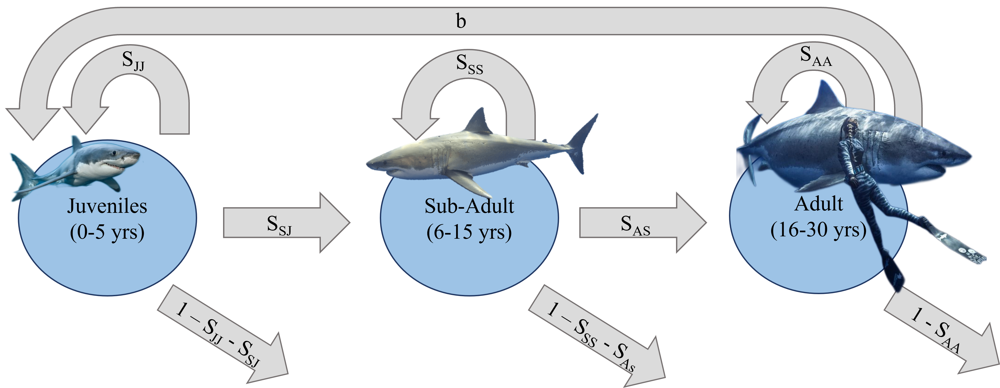

```{r, echo = FALSE, message = FALSE, warning = FALSE}
library(tidyverse)
library(popbio)
```


# Introduction

Apex predators have extensive and essential effects on marine communities (Heithaus *et al.*, 2008). Unfortunately, these high trophic species have been declining globally at an alarming pace, with regional estimates predicting shark declines to be at 90% or more  (Heithaus *et al.*, 2008). There are several shark species thought to fall under this category of keystone apex predators, including the white shark, *Carcharodon carcharias*. However, this cosmopolitan shark is highly mobile, with an extensive home range and long lifespan, making estimates of *C. carcharias* population trends difficult (Kanive et al., 2021). Recent studies of the Northeast Pacific white sharks living close to the highly developed coastlines of California and Mexico have produced vastly different estimates for population abundance ranging from less than 300 (Chapple et al. 2011) to over 2000 individuals (Burgess et al. 2014). White sharks are listed under the Vulnerable category of the IUCN red list (iucnredlist.org, verified October 2021), so more accurate modeling of their populations is essential for informing conservation efforts.

There are three key life stages for white sharks: juveniles, subadults and adults (Figure 1). White sharks are ovoviviparous and produce young through live birth at a rate of 1.55 pups per year (Burgess *et al.* 2014). Female white sharks reach sexual maturity after 15 years (Kanive *et al.* 2021), and subadults and adults have no natural predators except for killer whales (*Orcinus orca*; Jorgensen *et al.* 2019). However, for juvenile white sharks, death due to gillnet entanglement or other fishing gear interactions is a significant cause of mortality. Fishing mortality is estimated to be 0.289, which is over three times the estimated natural juvenile mortality rate of 0.079 (Benson *et al.*, 2018). Juvenile survival is essential for species longevity, as it has significant influence on individual fitness and overall population growth (Mollet & Cailliet, 2002). In contrast to this, the continued survival of adults and individuals about to recruit into the breeding stage is also essential for the subsistence of long lived species (Caswell, 2014). Thus, the survival of all life stages must be considered when determining how best to protect *C. carcharias*. 
 
To determine the status of the Northeast Pacific *C. carcharias* population and to understand how best it could be protected in the future, we used a series of stage-based population matrix models with three key objectives. First, we assessed current population parameters of growth rate, elasticity, sensitivity, and simulated future abundance based on data from Kanive *et al.* (2021). Secondly, we modeled changes in the survival of juveniles, subadults, and adults, and evaluated each of their impacts on overall population growth. Finally, we developed a series of candidate models demonstrating how several white shark conservation management scenarios could affect simulated population growth in the future. 
  
\newpage

# Model  

## Life Stages  

```{r GWS_Life_Cycle, fig.align = 'center', out.width = "75%", out.height = "75%", fig.cap = "White Shark (Caracharodon carcharias) life stages.", fig.cap.align = 'center', echo=FALSE}

```
  
In our models, we considered three key life stages for white sharks: juveniles, subadults and adults (Figure 1). Although some studies separate young of year (YOY) and juveniles (Onate-Gonzales *et al.* 2017), we chose to consider any shark under 6 years of age (approx. length < 300 cm) to be juvenile because our only data source for the survival of young white sharks merged YOY and juveniles to calculate population parameters (Benson *et al.* 2018). White sharks are considered to be subadult from ages 6 to 15, and have an approximate total length between 300 and 440 cm (Kanive *et al.* 2021). Mature reproductive females are greater than 15 years of age and exceed 440 cm in length (Kanive *et al.* 2021).  
  
## Parameter Values and Equations  

Our parameter values for subadults and adults ($S_{SJ}$, $S_{SS}$, $S_{AS}$, $S_{AA}$) were from Kanive *et al.* (2021). Juvenile survival ($S_{JJ}$) was from Benson *et al.* (2018). The fertility value (*b* = 1.55) was from Burgess *et al.* (2014) and was multiplied by 0.375 to determine the birth rate of females (*b* = 0.58125). We used this transformation because white shark sex ratios are reportedly skewed at 1 female per 1.6 males (Kanive *et al.* 2021). As we were unable to find sex specific data, we assume juvenile, subadult, and adult survivorship is consistent between males and females. 

To create our matrix we used the following equation.

**Equation 1:** $$\bold{N}_{t+1} = \bold{PN}_t$$  
Expanding this gives:
$$
\begin{pmatrix}
N_J(t+1) \\
N_S(t+1) \\
N_A(t+1)
\end{pmatrix} =
\begin{pmatrix}
S_{JJ} & S_{SJ} & b\\
S_{JS} & S_{SS} & S_{SA} \\
S_{AJ} & S_{AS} & S_{AA}
\end{pmatrix}
\begin{pmatrix}
N_J(t) \\
N_S(t) \\
N_A(t)
\end{pmatrix}
$$
where J = juvenile (0-5 years), S = subadult (6-15 years), A = reproductive adult (16-30 years).  
  
  
We then used the equations 2 to 4 to develop a population abundance model. Equation 5 was used to determine the eigenvalues of the population and thus the growth rate ($\lambda$) by identifying the largest eigenvalue. Equation 6 was used to determine the sensitivity (*S*) of each parameter in the model and equation 7 to determine the elasticity (*e*) of each parameter.  
  
**Equation 2:** $$N_J(t+1) = N_A(t)*b$$
**Equation 3:** $$N_S(t+1) = N_J(t)*S_{SJ} + N_S*S_{SS}$$
**Equation 4:** $$N_A(t+1) = N_S(t)*S_{AS} + N_A(t)*S_{AA}$$
**Equation 5:** $$det(\bold{P}-\bold{I}*\lambda) = 0$$
**Equation 6:** $$S_{IJ} = u_i*v_i$$ 
**Equation 7:** $$e_{IJ} = (P_{IJ}*\lambda)/(v_i*u_i)$$  
  
Sensitivity is a measure of how responsive, or sensitive, lambda is to a change in a given parameter. Elasticity is a scaled version of sensitivity; it determines the rate of change of the log of lambda with respect to the log of a given parameter. Determining the population parameter that results in the highest values of sensitivity and elasticity is important for management and protection purposes of populations, as it gives insight into which life stage is most fragile and should be targeted to most effectively and efficiently protect a population. 
  
The initial population values used to create the population abundance model are listed below in Table 1. 
  
```{r, echo = FALSE}
shark.data <- data.frame(matrix(c(0.63, 0, 0.58125, 0.10, 0.70, 0, 0, 0.09, 0.85), 
                                ncol=3, 
                                byrow=TRUE),
                         row.names=c("Juvenile","Subadult","Adult")) %>%
  rename("Juvenile" = "X1", "Subadult" = "X2", "Adult" = "X3")

knitr::kable(shark.data, table.attr = "style='width:70%", caption = "White shark population parameter values. Values for sub-adult to sub-adult annual survivorship ($S_{SS}$), adult to adult annual survivorship ($S_{AA}$), juvenile to sub-adult annual survivalship ($S_{SJ}$), and sub-adult to adult annual survivorship ($S_{AS}$) are referenced from Kanive *et al.* (2021). Values for juvenile to juvenile annual survivorship ($S_{JJ}$) are referenced from Bensen *et al.* (2018). The annual birth rate value (*b*) denoting the transition from adults to juveniles is referenced from Burgess *et al.* (2014).")

```
  
Inserting these shark survivorship parameter values found in Table 1 into the transition matrix gives:
$$
\begin{pmatrix}
N_J(t+1) \\
N_S(t+1) \\
N_A(t+1)
\end{pmatrix} =
\begin{pmatrix}
0.63 & 0 & 0.58125\\
0.10 & 0.70 & 0 \\
0 & 0.09 & 0.85
\end{pmatrix}
\begin{pmatrix}
N_J(t) \\
N_S(t) \\
N_A(t)
\end{pmatrix}
$$
```{r, echo=FALSE}
GWS_matrix = matrix(data = c(c(0.63, 0, 0.58125),  
                               c(0.10, 0.70, 0),  
                               c(0, 0.09, 0.85)),
                      nrow = 3, ncol = 3,
                      byrow = TRUE)
```

### Initial Population Parameters
First, we determined the projected population abundance (Eq. 2-4), elasticity (Eq. 5), sensitivity (Eq. 6), and growth rate (Eq. 6) using the survivorship values from Kanive *et al.* (2021) and Benson *et al.* (2018). For our projected population abundance curves we used current population predictions from literature of white sharks in the Northeastern Pacific ocean. We used an initial female subadult population of 49 individuals and female adult population of 62 individuals (Kanive *et al.* 2021). As there was no sex-specific value for juveniles in the literature, we determined the initial female juvenile population to be 56 individuals by multiplying the value we found in literature for total population (Bensen *et al.* 2018) by 0.3275 to reflect the previously identified 1:1.6 female to male sex ratio. After running the model, we determined the stable stage distribution (the proportion of each life stage making up the population when the growth rate is equal to 1) using the right eigenvector ($N_t$ in Eq 1).

### Changing Survival of Different Life Stages to Increase Lambda
Second, we simulated 1% changes in the survivorship of each life stage ($S_{JJ}$, $S_{SS}$ and $S_{AA}$) and calculated the resulting population growth rates ($\lambda$). The objective was to determine at which point an increase in individual survival rates of each life stage would produce a population growth rate greater than 1. A growth rate over 1 would suggest that the population is no longer in decline.

### Simulating Future Population Abundance Under Different Management Scenarios
Finally, we used the information gathered from our aforementioned manipulations of survival at each life stage to simulate three scenarios that could theoretically eliminate the decline in white shark populations by raising lambda above 1: 
  
1. Increasing juvenile survivorship ($S_{JJ}$) from 0.63 to 0.89.  
2. Increasing subadult survivorship ($S_{SS}$)  from 0.7 to 0.91.  
3. Increasing adult survivorship ($S_{AA}$) from 0.85 to 0.96.  
  
We also calculated the stable stage distribution of juveniles, subadults, and adults for our three scenarios.

\newpage

# Results  

### Initial Population Model  

Figure 2 projects the initial population trends using the values for current population and survivorship found in literature. The population is projected to be declining rapidly and total extinction is predicted within the next 100 years. This model predicts a slight increase in juvenile abundance within the next 10 years, followed by a rapid decline of all three life stages until species extinction.

```{r, echo=FALSE, fig.cap= "Projected population abundance over time based on a stage-based population model conducted using survivorship, current abundance and fecundity values from the literature.", message = FALSE, out.width = "70%", out.height = "70%"}
matrix_simulation = function(transition_matrix,
                             initial_pop,
                             time_steps) {
  # set a loop to indicate the updated population
  updated_pop = initial_pop
  
  for(i in 2:time_steps){
  # matrix multiplication
    updated_pop = transition_matrix %*% updated_pop
  }
  
  return(updated_pop)
}

sim_100 = matrix_simulation(GWS_matrix,
                            c(56, 49, 62),
                            100)

# make a matrix of abundance over 100 years
abundance_df = function(transition_matrix,
                        initial_pop,
                        time_steps) {
  # create empty matrix
  pop1 = matrix(rep(0,3*time_steps), 3, time_steps)
  
  # for any matrix in R - you can access the rows/columns 
  # with the square bracket indices
  # ex. matrix[row, column]
  # pop1[2,1] - row 2, column 1 of matrix pop1
  # pop1[2,] - all of row 2 (aka all columns) of matrix pop1
  # pop1[,2] - all of column 2 (aka all rows) of matrix pop1
  
  pop1[,1] = initial_pop
  
  # for loop for N_t+1 = \bold{P} N_t
  for(i in 2:time_steps) {
    pop1[,i] = (transition_matrix %*% pop1[,i-1])
  }
  
  # as a general rule, long dataframes are easiest to plot w/
  pop1_for_plot = data.frame(pop = c((pop1[1,]), (pop1[2,]),
                                    (pop1[3,])),
                            gen = c(rep("Juveniles", time_steps),
                                    rep("Subadult", time_steps),
                                    rep("Adult", time_steps)), 
                            ts = rep(c(1:time_steps), 3))
  
  # what the above code is doing is taking our matrix, putting the values
  # in the "pop" column of this new dataframe, labeling each observation
  # with a level in the "gen" column, and then adding the timesteps into
  # the "ts" column
} 

pop_100_yrs = abundance_df(GWS_matrix, 
                           c(56, 49, 62), 
                           100)
pop_100_yrs$gen = factor(pop_100_yrs$gen, 
                               levels=c("Juveniles","Subadult","Adult"))
ggplot(data = pop_100_yrs) + 
  geom_line(aes(x = ts, y = pop, colour = gen), size = 1.05) +
  theme_bw() +
  theme(text = element_text(family = "serif")
  ) +
  labs("Life Stage", x = "Time (Years)", y = "Population abundance (N)") +
  scale_colour_manual("Life Stage", values = c("navy", "steelblue", "skyblue"))
```

### Lamba, Stable Stage Distribution, Elasticity, Sensitivity  
Lambda was calculated to be 0.927. At stable stage distribution, over half of the population are juveniles ($N_J(t+1)$ = 0.51), with approximately equal proportions of subadults ($N_S(t+1)$ = 0.23) and adults ($N_A(t+1)$ = 0.26).  
  
Table 2 outlines the calculated sensitivity values of lambda corresponding to all parameters. As shown, the growth rate is most sensitive to changes in the adult to adult survivorship rate (*s* = 0.625). Furthermore, lambda is least sensitive to changes in the birthrate (*s* = 0.083), followed by changes in the juvenile to juvenile survivorship rate (*s* = 0.163).  
  
```{r, echo = FALSE}
matrix_values = eigen.analysis(GWS_matrix, zero = TRUE)
matrix_sensitivity <- data.frame(matrix(c(0.163, 0, 0.083, 0.483, 0.213, 0, 0, 0.537, 0.625), 
                                ncol=3, 
                                byrow=TRUE),
                         row.names=c("Juvenile","Subadult","Adult")) %>%
  rename("Juvenile" = "X1", "Subadult" = "X2", "Adult" = "X3")
knitr::kable(matrix_sensitivity, table.attr = "style='width:70%", caption = "White shark population sensitivity values of all parameters calculated from a stage-based population model using values from the literature.")
```
  
Table 3 describes the calculated elasticity values of lambda corresponding to all parameters. The log of lambda is most elastic with respect to the log of the adult to adult survivorship rate (*e* = 0.573). Additionally, the log of lambda is least elastic with respect to the log of birth rate, juvenile to subadult survivorship rate and subadult to adult survivorship rate (*e* = 0.052).  

  
```{r, echo = FALSE}
matrix_elasticity <- data.frame(matrix(c(0.110, 0, 0.052, 0.052, 0.160, 0, 0, 0.052, 0.573), 
                                ncol=3, 
                                byrow=TRUE),
                         row.names=c("Juvenile","Subadult","Adult")) %>%
  rename("Juvenile" = "X1", "Subadult" = "X2", "Adult" = "X3")
knitr::kable(matrix_elasticity, table.attr = "style='width:70%", caption = "White shark population elasticity values calculated from a stage-based population model using values from the literature.")
```

### Changing Survival of Different Life Stages

The effect of increasing life stage survivorship on lambda varied across juvenile, subadult and adult white sharks (Figure 3). The most sensitive parameter, adult survival ($S_{AA}$), required the lowest change in survivorship (0.85 to 0.96) to increase lambda above 1. Subadult ($S_{SS}$) and juvenile ($S_{JJ}$) life stages required greater increases in survivorship to have the same effect on population growth (0.63 to 0.89 and 0.7 to 0.91, respectively). 

```{r, echo=FALSE, fig.cap= "Population growth rates resulting from changing individual survivorship parameters for juvenile, subadult and adult white sharks. The dotted line indicates a population growth rate of 1 and squares represent the initial survivorship values of each life stage.", message = FALSE, out.width = "80%", out.height = "80%"}
decreased_survival = function(transition_mat, initial_mat, iteration) {

   output = vector()
  updated_mat = transition_mat

  for(i in 1:iteration){
    updated_mat = updated_mat - initial_mat # matrix addition
    lambda = lambda(updated_mat)
    output[[i]] = lambda

  }
return(output)
}

increased_survival = function(transition_mat, initial_mat, iteration) {

   output = vector()
  updated_mat = transition_mat

  for(i in 1:iteration){
    updated_mat = updated_mat + initial_mat # matrix addition
    lambda = lambda(updated_mat)
    output[[i]] = lambda

  }
return(output)
}

# running the function for juveniles
juv_modified = matrix(data=c(c(0.01,0,0),
                             c(0, 0, 0),
                             c(0, 0, 0)),
                      nrow=3, ncol=3, 
                      byrow = TRUE)

juvenile_lambdas_improved =  increased_survival(GWS_matrix, juv_modified, 30) 
juvenile_improved = data.frame(delta_survival = (63+1:30)/100, 
                           lambda = juvenile_lambdas_improved,
                           treatment = "Increasing_Survival",
                           stage = "Juveniles")

juvenile_lambdas_decrease =  decreased_survival(GWS_matrix, juv_modified, 30) 
juvenile_decrease = data.frame(delta_survival = (63-1:30)/100, 
                           lambda = juvenile_lambdas_decrease, 
                           treatment = "Decreasing_Survival",
                           stage = "Juveniles")

juveniles = rbind(juvenile_decrease, juvenile_improved)

rm("juvenile_decrease", "juvenile_improved", 
   juvenile_lambdas_decrease, juvenile_lambdas_improved)

# Running the function for subadults
sub_modified = matrix(data=c(c(0,0,0),
                             c(0, 0.01, 0),
                             c(0, 0, 0)),
                      nrow=3, ncol=3, 
                      byrow = TRUE)

sub_lambdas_improved =  increased_survival(GWS_matrix, sub_modified, 30) 
sub_increase= data.frame(delta_survival = (70+1:30)/100, 
                           lambda = sub_lambdas_improved,
                           treatment = "Increasing_Survival",
                         stage = "Subadult")

sub_lambdas_decrease =  decreased_survival(GWS_matrix, sub_modified, 30) 
sub_decrease = data.frame(delta_survival = (70-1:30)/100, 
                           lambda = sub_lambdas_decrease, 
                           treatment = "Decreasing_Survival",
                          stage = "Subadult")

subadults = rbind(sub_decrease, sub_increase)

rm("sub_decrease", "sub_increase", 
   sub_lambdas_decrease, sub_lambdas_improved)

# Running the function for adults
ad_modified = matrix(data=c(c(0,0,0),
                             c(0, 0, 0),
                             c(0, 0, 0.01)),
                      nrow=3, ncol=3, 
                      byrow = TRUE)


ad_lambdas_improved =  increased_survival(GWS_matrix, ad_modified, 30) 
ad_increase= data.frame(delta_survival = (85+1:30)/100, 
                           lambda =ad_lambdas_improved,
                           treatment = "Increasing_Survival",
                        stage = "Adult")

ad_lambdas_decrease =  decreased_survival(GWS_matrix, ad_modified, 30) 
ad_decrease = data.frame(delta_survival = (85-1:30)/100, 
                           lambda = ad_lambdas_decrease, 
                           treatment = "Decreasing_Survival", 
                         stage = "Adult")

adults = rbind(ad_decrease, ad_increase)

rm("ad_decrease", "ad_increase", 
   ad_lambdas_decrease, ad_lambdas_improved)

lambda_data = rbind(juveniles, subadults, adults)

rm("adults", "juveniles", "subadults")

lambda_points = data.frame(surv = c(0.63, 0.7, 0.85), 
                           lam=c(0.9273703, 0.9273703, 0.9273703), 
                           stage = c("Juveniles", "Subadult", "Adult"))

lambda_data$stage = factor(lambda_data$stage, 
                               levels=c("Juveniles","Subadult","Adult"))

ggplot(lambda_data, aes(x=delta_survival, y=lambda, color=stage))+
  geom_line(size = 1)+
  geom_point(data=lambda_points, aes(x=surv, y=lam, color=stage), size = 3, shape = 15)+
  geom_hline(yintercept=1, linetype= 2)+
  scale_color_manual("Life Stage",values = c("navy", "steelblue", "skyblue")) + 
  xlab("Modified Survival for Individual Life Stages") + ylab("Population Growth Rate")+
  scale_x_continuous(breaks = seq(0.3, 1.2, 0.1))+ scale_y_continuous(breaks = seq(0.8, 1.2, 0.05))+
  theme_bw()+
  theme(
    text = element_text(family="serif")
  )

```


\newpage
### Simulating Future Population Abundance

Modifying the survivorship of juveniles, subadults and adults each had different effects on the simulated abundance of all life stages (Figure 4). The first scenario, modifying juvenile survivorship, changed the stable stage population distribution from our initial population matrix to be biased towards juveniles ($N_J(t+1)$ = 0.66) with lower proportional abundances of subadults ($N_S(t+1)$ = 0.22) and adults ($N_A(t+1)$ = 0.12). Changing subadult survivorship caused our subadult life stage become proportionally greater ($N_S(t+1)$ = 0.37) than juveniles ($N_J(t+1)$ = 0.39) and adults ($N_A(t+1)$ = 0.23). Improving adult survivorship reduced our subadult population slightly but otherwise did not drastically change the stable stage distribution values compared to our initial population ($N_J(t+1)$ = 0.51; $N_S(t+1)$ = 0.16; $N_A(t+1)$ = 0.33)


```{r, echo=FALSE, fig.cap= "Projected white shark population abundances resulting from modifying the survivorship of juveniles (0.63 to 0.89), subadults (0.7 to 0.91) and adults (0.85-0.96) to generate a population growth rate above 1.", message = FALSE, out.width = "90%", out.height = "90%"}
juv_surv = matrix(data=c(c(0.89,0,0.58125),
                             c(0.1, 0.7, 0),
                             c(0, 0.09, 0.85)),
                      nrow=3, ncol=3, 
                      byrow = TRUE)
juv_distributions = eigen.analysis(juv_surv, zero=TRUE)

sub_surv = matrix(data=c(c(0.63,0,0.58125),
                             c(0.1, 0.91, 0),
                             c(0, 0.09, 0.85)),
                      nrow=3, ncol=3, 
                      byrow = TRUE)
subad_distributions = eigen.analysis(sub_surv, zero=TRUE)

ad_surv = matrix(data=c(c(0.63,0,0.58125),
                             c(0.1, 0.7, 0),
                             c(0, 0.09, 0.96)),
                      nrow=3, ncol=3, 
                      byrow = TRUE)
ad_distributions =eigen.analysis(sub_surv, zero=TRUE)


# Write a function to simulate abundance over 100 several years
abundance_sim = function(transition_matrix,
                        initial_pop,
                        time_steps) {
  
  pop1 = matrix(rep(0,3*time_steps), 3, time_steps)
  
  pop1[,1] = initial_pop
  
  for(i in 2:time_steps) {
    pop1[,i] = (transition_matrix %*% pop1[,i-1])
  }
  
  pop1_for_plot = data.frame(pop = c((pop1[1,]), (pop1[2,]),
                                    (pop1[3,])),
                            gen = c(rep("Juveniles", time_steps),
                                    rep("Subadult", time_steps),
                                    rep("Adult", time_steps)), 
                            ts = rep(c(1:time_steps), 3))
}

# Simulate abundance of each population 
  
pop_100yrs_juv = abundance_sim(juv_surv, c(56,49,62),100)
pop_100yrs_juv = cbind(pop_100yrs_juv, data.frame(manip = "Juvenile Survival Increased"))

pop_100yrs_sub = abundance_sim(sub_surv, c(56,49,62),100)
pop_100yrs_sub = cbind(pop_100yrs_sub, data.frame(manip = "Subadult Survival Increased"))

pop_100yrs_ad = abundance_sim(ad_surv, c(56,49,62),100)
pop_100yrs_ad =cbind(pop_100yrs_ad, data.frame(manip = "Adult Survival Increased"))

pop_100_yrs_sim = rbind(pop_100yrs_juv, pop_100yrs_sub, pop_100yrs_ad)

rm("pop_100yrs_juv", "pop_100yrs_sub", "pop_100yrs_ad")

# Graphing the abundance of each population 

pop_100_yrs_sim$manip = factor(pop_100_yrs_sim$manip, 
                               levels=c("Juvenile Survival Increased","Subadult Survival Increased", "Adult Survival Increased"))

pop_100_yrs_sim$gen = factor(pop_100_yrs_sim$gen, 
                               levels=c("Juveniles","Subadult", "Adult"))

ggplot(data = pop_100_yrs_sim) + 
  geom_line(aes(x = ts, y = pop, colour = gen), size = 1.05) +
  theme_bw() +
  theme(
    text = element_text(family="serif")
  ) +
  labs("Life Stage", x = "Time (Years)", y = "Population abundance (N)") +
  scale_colour_manual("Life Stage", values = c("navy", "steelblue", "skyblue"))+
  facet_wrap(manip~.)
```


\newpage
# Discussion
  
The initial projected population abundance model was based on current trends of survivorship and abundance found in the literature (Kanive *et al.* 2021 and Benson *et al* 2018). This model indicated a value of lambda less than one. This growth rate implies that the Northeast Pacific white shark population is slowly declining. This trend is further outlined in Figure 2, which shows total species extinction occurring within the next 100 years. This value of lambda is somewhat comparable to those found in the literature, such as 1.05 and 1.07 (Kanive *et al.* 2021). However, these published results indicate that the population is growing, while our model indicates that urgent conservation action must be taken to protect this iconic apex predator. Our study may differ because it is the first to integrate juvenile, subadult and adult survivorship into one succinct model.  
  
Within the results of the stable stage distribution, the juvenile population is significantly more abundant than the subadults and adults. This led us to believe that perhaps the survivorship of juveniles must be ameliorated, as a large juvenile population would facilitate larger subadult and adult populations. However, upon completion of the sensitivity and elasticity analyses it becomes clear that the growth rate of the white shark population of the Northeast Pacific is most sensitive to changes in the adult to adult ($S_{AA}$) survivorship rate. Thus, this indicates that the most effective and efficient way to create prolonged species survival for white sharks in the Northeast Pacific is to protect reproductive age adults.   
  
We further investigated how different scenarios increasing the survival of specific life stages could impact population growth and structure. This analysis revealed that increasing adult to adult survivorship ($S_{AA}$) had the largest positive impact on population growth and projected population abundances (Figure 2, 3). This confirmed our earlier sensitivity and elasticity findings, and demonstrates how actions targeted at the most sensitive life stage would likely be the most effective for white shark conservation. However, conservation efforts are currently focused on increasing juvenile survival (Benson *et al.* 2018). This is because adult white sharks are highly mobile and poorly understood, making them difficult to protect (Kanive *et al.*, 2021). Based on our findings, this could impact the stable stage distribution of white sharks, which may have undesirable consequences in the face of unpredictable environmental variability that could affect certain life stages more than others. We therefore suggest that future population modelling studies quantify how management actions targeting the survival of multiple life stages could affect population dynamics. Developing strategies to increase subadult and adult survival also warrants attention because these will assist in the implementation of a holistic management plan to eliminate the decline in white shark populations. An ideal management plan would increase the survivorship of all life stages, which would be the most likely to benefit population growth and abundance while retaining current stable stage distributions. 
  
There are several limitations to our analysis that are worth noting. First, our data sources are based on mark-recapture studies that were done with few individuals and produced measures of uncertainty (standard errors and confidence intervals) for their parameters (Kanive et al. 2021; Benson et al. 2018). We used these parameters without considering their inherent uncertainty and without quantifying uncertainty in our analyses. Another caveat of our analysis is that we assumed the skewed sex distribution reported by Kanive et al. (2021) was caused biologically and adjusted our population birth rate from Burgess et al. (2014) accordingly. However, if this skewed sex distribution was caused by sampling biases, it introduces a source of error into our analysis. Finally, we assumed that survival did not differ among male and female juvenile, subadult or adult white sharks because our values from the literature were not sex-specific (Kanive et al. 2021; Benson et al. 2018). Female white sharks are larger than male white sharks (Kanive et al. 2019) and may have higher survival rates, but the skewed sex ratios may indicate higher male survival (Kanive et al. 2021). Regardless, assuming equal survival among sexes is a major caveat of our model.  
  
Although our population model has several limitations, it also highlights the need for conservation actions to target multiple stages of white shark lives. Current efforts to increase juvenile survivorship by reducing fishing entanglement (Benson et al. 2018), while warranted, will skew stable stage population distributions and are not the most effective way to increase population growth unless accompanied by actions to increase the survivorship of subadult and especially adult white sharks. As such, actions used on other charismatic ocean carnivores like habitat protection, reduced depletion of fish stocks, and reduced boat disturbances demand investigation and implementation. Without taking urgent and informed conservation actions, white sharks may disappear from the Pacific Northeast Ocean before the end of this century.  

\newpage 

# **Literature Cited**  
Benson, J. F., Jorgensen, S. J., O’Sullivan, J. B., Winkler, C., White, C. F., Garcia-Rodriguez, E., Sosa-Nishizaki, O., & Lowe, C. G. (2018). Juvenile survival, competing risks, and spatial variation in mortality risk of a marine apex predator. Journal of Applied Ecology, 55(6), 2888–2897. https://doi.org/10.1111/1365-2664.13158 
  
Burgess, G. H., Bruce, B. D., Cailliet, G. M., Goldman, K. J., Grubbs, R. D., Lowe, C. G., MacNeil, M. A., Mollet, H. F., Weng, K. C., O’Sullivan, J. B. (2014). A re-evaluation of the size of the white shark (Carcharodon carcharias) population off California, USA. <i>PLoS ONE</i>, <i>9</i>(6). https://doi.org/10.1371/JOURNAL.PONE.0098078</div>  

Caswell, H. 2014. Matrix population models. In Wiley Stats Ref: Statistics Reference Online. John Wiley & Sons, Ltd. https://doi.org/10.1002/9781118445112.stat07481 

Chapple, T. K., Jorgensen, S. J., Anderson, P. E., Kanive, A., Klimley, A. P., Bostford, L. W., Block, B. A. (2011). A first estimate of white shark, Carcharodon carcharias, abundance off Central California. <i>Biology Letters<i>, 7, 581-583. doi:10.1098/rsbl.2011.012 
  
Heithaus, M. R., Frid, A., Wirsing, A. J., & Worm, B. (2008). Predicting ecological consequences of marine top predator declines. In Trends in Ecology and Evolution (Vol. 23, Issue 4). https://doi.org/10.1016/j.tree.2008.01.003 

Jorgensen, S. J., Anderson, S., Ferretti, F., Tietz, J. R., Chapple, T., Kanive, P., Bradley, R. W., Moxley, J. H., & Block, B. A. (2019). Killer whales redistribute white shark foraging pressure on seals. Scientific Reports 2019 9:1, 9(1), 1–9. https://doi.org/10.1038/s41598-019-39356-2 

Kanive, P. E., Rotella, J. J., Jorgensen, S. J., Chapple, T. K., Hines, J. E., Anderson, S. D., & Block, B. A. (2019). Size-specific apparent survival rate estimates of white sharks using mark–recapture models. Https://Doi.Org/10.1139/Cjfas-2018-0142, 76(11), 2027–2034. https://doi.org/10.1139/CJFAS-2018-0142  

Kanive, P. E., Rotella, J. J., Chapple, T. K., Anderson, S. D., White, T. D., Block, B. A., & Jorgensen, S. J. (2021). Estimates of regional annual abundance and population growth rates of white sharks off central California. Biological Conservation, 257, 109104. https://doi.org/10.1016/J.BIOCON.2021.109104 

Myers, R. A., Baum, J. K., Shepherd, T. D., Powers, S. P., & Peterson, C. H. (2007). Cascading effects of the loss of apex predatory sharks from a coastal ocean. Science, 315(5820). https://doi.org/10.1126/science.1138657 

Mollet, H. F., & Cailliet, G. M. (2002). Comparative population demography of elasmobranchs using life history tables, Leslie matrices and stage-based matrix models. Marine and Freshwater Research, 53(2). https://doi.org/10.1071/MF01083 
  
Oñate-González, E. C., Sosa-Nishizaki, O., Herzka, S. Z., Lowe, C. G., Lyons, K., Santana-Morales, O., Sepulveda, C., Guerrero-Ávila, C., García-Rodríguez, E., & O’Sullivan, J. B. (2017). Importance of Bahia Sebastian Vizcaino as a nursery area for white sharks (Carcharodon carcharias) in the Northeastern Pacific: A fishery dependent analysis. Fisheries Research, 188, 125–137. https://doi.org/10.1016/J.FISHRES.2016.12.014  
